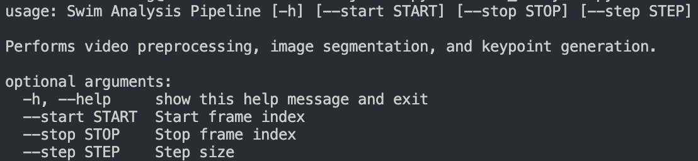

# EE267 Spring 2025 Term Project: Swimmer Segmentation and Pose Estimation

## Setup

Setup a virtual environment.
```bash
python -m venv venv
```

Activate the newly created virtual environment.
```bash
source venv/bin/activate
```

Install project dependencies.
```bash
pip install -r requirements.txt
```

## Preprocessing, Image Segmentation, & Keypoint Generation
```bash
python swim_analysis.py [stroke] [start] [stop] [step]
```
- stroke: 
## Project Overview

Here is an overview of how to run the swim analysis pipeline:



Run swim_analysis.py to perform video preprocessing, frame-by-frame transformation, image segmentation, and keypoint generation.

